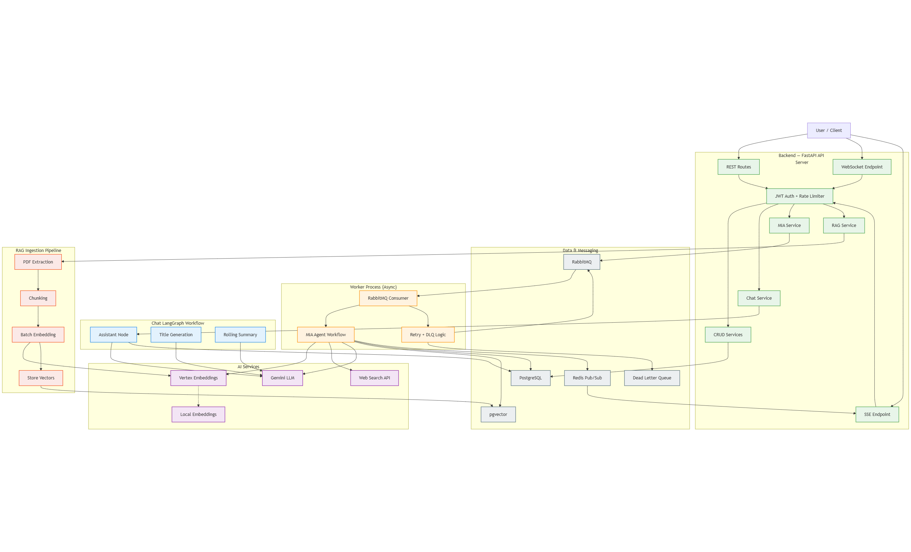

# Akira

**An AI-powered motorcycle diagnostic platform that orchestrates multi-step reasoning pipelines-searching technical manuals, querying the web, generating structured repair plans, and matching parts against real inventory.**

---

## What It Does

Akira is a production system for motorcycle workshops that combines two AI products with workshop management tooling:

**Akira Chat** - A conversational assistant that streams responses token-by-token over WebSocket. Maintains unlimited conversation history through rolling summarization, keeping token usage flat regardless of conversation length.

**MIA (Mechanic Intelligence Assistant)** - An asynchronous diagnostic engine. A mechanic describes symptoms, and the system:
1. Searches internal technical manuals (RAG over pgvector) and the web (Tavily) in parallel
2. Generates a structured repair plan with prioritized tasks, difficulty ratings, time estimates, and torque specs
3. Enriches each part with inventory availability, pricing, and alternatives

The entire MIA pipeline runs asynchronously via **RabbitMQ**, with stage-by-stage progress streamed to clients through **Redis Pub/Sub** and **SSE**. The platform also handles customers, vehicles, mechanics, service jobs, and PDF manual ingestion.

---

## Mia Workflow
<video src="https://github.com/user-attachments/assets/49cd17ed-7c2b-4e2f-b1d7-5d917af96b06" autoplay loop muted playsinline controls style="max-width: 100%;"></video>

## Tech Stack

| Layer | Technologies |
|-------|-------------|
| **Frontend** | Next.js 15, React, TypeScript, Tailwind CSS, shadcn/ui, Zustand, TanStack React Query, Zod, react-hook-form |
| **Backend** | Python, FastAPI, SQLModel, asyncpg, Pydantic, Uvicorn |
| **AI** | LangGraph, LangChain, Gemini, Vertex AI Embeddings, LM Studio Local Embeddings, Tavily, tiktoken |
| **Infrastructure** | PostgreSQL + pgvector, RabbitMQ, Redis, Docker, Clerk (auth) |
| **Tooling** | Poetry, Ruff, Biome, Husky, LangSmith |

---

## Architecture

**Key design decision:** The API server and worker process share infrastructure but never share memory. The API never blocks on long-running AI work, and workers scale independently.

**Three request patterns:**

| Pattern | Flow |
|---------|------|
| **CRUD** | Synchronous REST → Clerk auth → rate limiting → service layer → PostgreSQL |
| **Chat** | WebSocket connection → LangGraph runs inline → Gemini streams tokens → auto-title + rolling summarization |
| **MIA** | API publishes to RabbitMQ → worker executes pipeline → Redis relays progress → API streams SSE to client |



**MIA pipeline stages:**
```
Queued (0%) → Fetching Data (15%) → Researching (35%) →
Generating Plan (60%) → Checking Inventory (85%) → Done (100%)
```

---

## Core Capabilities

**AI & Orchestration**
- LangGraph StateGraphs for all workflows - explicit, testable, observable pipelines with built-in streaming
- Token-by-token chat streaming with automatic conversation titling and incremental summarization
- LLM-generated search queries optimized for both RAG and web search given service job context
- Structured plan generation with validated JSON schemas (Pydantic)

**Infrastructure**
- Asynchronous job processing with 3-attempt retry logic and dead-letter routing
- Cross-process real-time updates via Redis Pub/Sub relayed as SSE
- Sliding-window rate limiting keyed by user ID or IP
- Clerk authentication enforced across HTTP, WebSocket (JWT in sub-protocol header), and SSE

**RAG & Search**
- Sentence-boundary chunking with `tiktoken` (512 tokens, 50-token overlap)
- Batch embedding with exponential backoff (Vertex AI or local LM Studio)
- Context expansion - retrieves neighboring chunks beyond exact matches
- Parallel RAG + web search fan-out for comprehensive evidence gathering

**Data & Matching**
- Vector-based parts matching with vehicle compatibility scoring
- PDF ingestion pipeline: extract → chunk → embed → pgvector storage
- Provider abstraction for swapping embedding backends via config

---

## System Design Highlights

### Workflow Orchestration

All AI behavior is expressed as **LangGraph StateGraphs** - explicit graphs that define each node, conditional edge, and data flow. The chat graph streams model tokens, auto-generates titles, and performs incremental summarization based on a sliding message window. The MIA graph parallelizes RAG and web search, synchronizes retrieved evidence, generates a validated structured plan, and enriches parts with inventory matches. 

Graph-first design delivers **predictable orchestration**, built-in streaming, and simple extensibility.

### RAG Pipeline

PDFs are chunked at sentence boundaries using `tiktoken` token counting (512-token chunks, 50-token overlap), embedded in batches of 100 with exponential backoff, and stored as pgvector rows indexed by source, vehicle model, and section. 

At retrieval time, the system **doesn't just return matched chunks** - it fetches neighboring chunks by `chunk_index` from the same source document, expanding context beyond the matched fragment. The LLM generates the search query itself given the service job context, rather than using raw user input.

### Real-Time Communication

**WebSocket** handles chat because it's bidirectional - the client sends messages and receives streaming responses on the same connection. 

**SSE** handles MIA progress because it's unidirectional and works cross-process - the worker publishes to Redis, the API server subscribes and streams. The SSE implementation uses `fetch()` + `ReadableStream` instead of `EventSource` because `EventSource` doesn't support auth headers.

### Token Optimization

The chat system loads only the last **15 messages** and injects a rolling summary as a system message. When the conversation grows beyond the summary's coverage window, a new summary is generated **incrementally from the old one** - not from scratch. 

This gives the model context over arbitrarily long conversations while keeping token usage bounded. Thread titles are generated once from the first two messages and never regenerated.

### Worker Resilience

Failed MIA jobs don't disappear. The worker acks the message, increments an `x-retry-count` header, and republishes - up to **3 retries** with a fresh database session each time. After exhaustion, the message routes to a **dead-letter queue** via a dedicated DLX exchange for post-mortem analysis. 

The queue uses `prefetch_count=1` for backpressure so a single slow job doesn't starve the worker.

---

## Monorepo Structure

```
akira/
├── server/                 # Python backend - API server + worker
│   ├── app/
│   │   ├── api/v1/         # Route handlers (chat, customer, vehicle, mia, rag, mechanic)
│   │   ├── workflows/      # LangGraph state graphs (chat, MIA)
│   │   ├── services/       # Business logic layer
│   │   ├── clients/        # LLM, embedding, and web search client abstractions
│   │   ├── prompts/        # System prompts for all agents
│   │   ├── model/          # SQLModel definitions, request/response schemas
│   │   ├── core/           # Database, Redis, RabbitMQ, WebSocket, SSE infrastructure
│   │   ├── middleware/     # Auth, rate limiting, logging
│   │   ├── config/         # Logger configuration
│   │   ├── settings/       # Environment-driven settings
│   │   ├── constants/      # Domain constants and enums
│   │   └── utils/          # Auth, chat, RAG, inventory utilities
│   ├── scripts/            # Dev server, worker, linting, DB seeding
│   └── creds/              # Service account credentials
├── webclient/              # Next.js frontend
│   └── src/
│       ├── app/            # App Router pages (chat, mia, auth)
│       ├── components/     # 101 components across 8 domains
│       ├── hooks/          # React Query wrappers, WebSocket, SSE
│       ├── stores/         # Zustand stores
│       ├── actions/        # API call functions
│       ├── services/       # Axios client with auth interceptors
│       ├── schema/         # Zod validation schemas
│       ├── types/          # TypeScript domain models
│       ├── constants/      # Color maps, stage configs
│       └── lib/            # Utilities
├── docker-compose.yml      # RabbitMQ + Redis
└── package.json            # Root - Husky pre-commit hooks
```

---

## Local Development Setup

### Prerequisites

- Python 3.12+, Poetry 1.8+ (including 2.x)
- Node.js 18+, npm
- PostgreSQL with pgvector extension
- Docker

### Start Infrastructure

```bash
docker compose up -d          # RabbitMQ (5672, 15672) + Redis (6379)
```

### Backend

```bash
cd server
poetry install
cp .env.example .env          # Then fill in your API keys and credentials
poetry run dev                # API server - localhost:8000, hot reload
poetry run worker             # Worker - separate terminal
```

### Frontend

```bash
cd webclient
npm install
npm run dev                   # localhost:3000 - Turbopack + HMR
```

<details>
<summary>Required environment variables</summary>

**Backend** (`server/.env`)

| Variable | Description |
|----------|-------------|
| `DATABASE_URL` | PostgreSQL connection string |
| `RABBITMQ_USER` / `RABBITMQ_PASS` | RabbitMQ credentials |
| `GEMINI_API_KEY` | Google Gemini API key |
| `GCP_PROJECT_ID` | GCP project for Vertex AI embeddings |
| `VERTEX_SERVICE_ACCOUNT_JSON_PATH` | Service account JSON path |
| `TAVILY_API_KEY` | Tavily web search API key |
| `CLERK_JWT_PUBLIC_KEY` | Clerk RSA public key for JWT verification |
| `CORS_ORIGINS` | Allowed origins (e.g., `["http://localhost:3000"]`) |

**Frontend** (`webclient/.env`)

| Variable | Description |
|----------|-------------|
| `NEXT_PUBLIC_BACKEND_URL` | Backend URL (e.g., `http://localhost:8000`) |
| `NEXT_PUBLIC_CLERK_PUBLISHABLE_KEY` | Clerk publishable key |
| `CLERK_SECRET_KEY` | Clerk secret key |

</details>

---

## Deployment

The architecture is designed for horizontal scaling. Workers are stateless queue consumers that can be replicated independently of the API server. Redis Pub/Sub bridges cross-process communication regardless of worker count.

Current setup runs locally with Docker Compose providing RabbitMQ and Redis. The backend includes a Dockerfile for containerized deployment.

---

## Future Improvements

- Distributed rate limiting via Redis (currently in-memory, single-process)
- Alembic migrations (schema currently auto-created at startup)
- WebSocket connection recovery with message replay on reconnect
- Multi-model LLM routing (cheaper models for summarization/titles, primary model for diagnostic reasoning)
- Streaming for MIA plan generation (currently returns full plan after completion)
- Frontend test coverage (harness exists, no tests implemented)
- CI/CD pipeline with automated linting, type checking, and deployment
